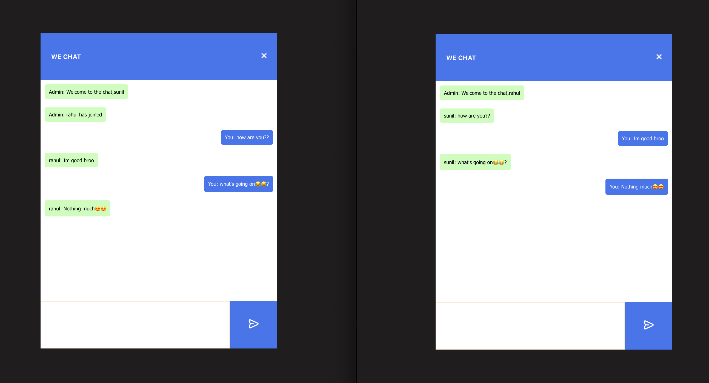

# Real-time Chat Application [**Live**](https://gsunil-chat-react.netlify.app/)

This is a real-time chat application built with React.js that enables users to engage in live conversations and collaborate in real-time using Socket.IO for the WebSocket connection.

## Backend code:

the backend node.js code is available at here (https://github.com/gsunil99/chat-backend)

## Features

- Real-time communication: Users can send and receive messages in real-time, allowing instant conversations.
- User presence: Users can see who is currently online and actively participating in the chat.
- Notifications: Users receive notifications when new messages are received or when they are mentioned in a conversation.

## Project Image

## Technologies Used

- React.js: Frontend JavaScript library for building user interfaces.
- Socket.IO: JavaScript library for enabling real-time bidirectional communication between the client and the server.
- CSS: Styling and layout of the application.
- HTML: Structure and markup of the application.

## Getting Started

Download the backend code mentioned above and continue with below process

### Installation

1.  Clone the repository: `git clone https://github.com/gsunil99/chat-frontend`
2.  Navigate to the project directory: `cd realtime-chat-app`
3.  Install dependencies: `npm install`

### Running the Application

1.  Start the development server: `npm start`
2.  Open the application in your browser: `http://localhost:3000`

## Contributing

Contributions are welcome! If you find any bugs or have suggestions for improvements, please open an issue or submit a pull request.

## Acknowledgments

- [React.js](https://reactjs.org/)
- [Socket.IO](https://socket.io/) - JavaScript library for real-time communication.
- [ChatsApp](https://github.com/chatsapp) - Inspiration and reference for real-time chat functionality.

Feel free to customize this README file based on your specific application and requirements.
